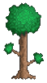

# Terraria3D

> ⚠️ **WARNING: EARLY DEVELOPMENT STAGE** ⚠️
>
> This project is in very early development. Features are incomplete, the game is not playable in its current state, and there may be numerous bugs.

    

A remake of Terraria, built with Godot Engine and C#. Explore, build, and survive in a fully 3D block world with infinite terrain generation.

## 🎮 Features

-   **3D Voxel World**: Fully destructible and placeable 3D blocks
-   **Infinite Terrain**: Procedural world generation with multiple biomes
-   **Cross-platform**: Runs on Windows, macOS, and Linux

Made with ❤️ by the Terraria3D development team
