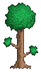

# Terraria3D

> ⚠️ **警告：早期开发阶段** ⚠️
> 
> 本项目处于非常早期的开发阶段。功能尚不完整，游戏在当前状态下不可玩，且可能存在大量bug。

    

《泰拉瑞亚》的 3D 重制版，使用 Godot 引擎和 C#构建。在完全 3D 的方块世界中探索、建造和生存，享受无限地形生成的乐趣。

## 🎮 游戏特色

-   **3D 体素世界**：完全可破坏和放置的 3D 方块

-   **无限地形**：程序化世界生成，包含多种生物群系

-   **跨平台**：支持 Windows、macOS 和 Linux

由 Terraria3D 开发团队用 ❤️ 制作
